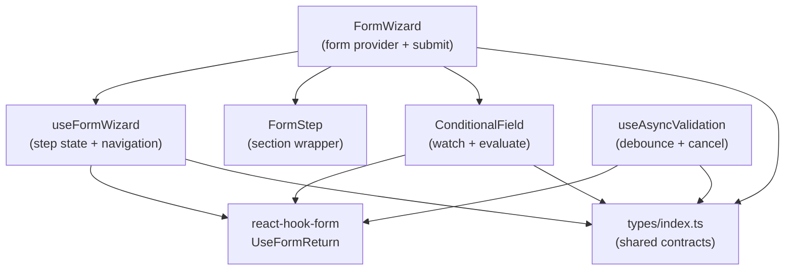

# @itiana/form-architect

Multi-step form wizard library for React — composable, type-safe, and built on react-hook-form.

---

## What Problem It Solves

Single-page forms become hard to manage once they branch on user choices, require async field checks, or span more than a screen's worth of inputs. `@itiana/form-architect` gives you a structured wizard model — steps, per-step validation, conditional field rendering, and debounced async checks — without replacing react-hook-form's validation engine. Each step validates only its own registered fields before advancing, so users see errors at the right moment rather than all at once on submit.

---

## When to Use

- Multi-step onboarding or registration wizards
- Checkout flows (shipping → payment → review)
- Branching surveys where later questions depend on earlier answers
- Configuration UIs where async checks (username availability, coupon codes) gate step advancement
- Any flow where you want validated forward progress and the ability to go back

## When NOT to Use

- Single-step forms — react-hook-form alone is simpler
- Forms that run as React Server Actions (RSC / Next.js server-side submit)
- Dynamic field arrays (`useFieldArray`) — this library has no built-in field array support
- UIs that need to control the active step index from outside the wizard

---

## Compatibility

| Dependency      | Tested version | Notes                                  |
|-----------------|----------------|----------------------------------------|
| React           | 18.x           | React 19 not verified                  |
| react-hook-form | ^7.0.0         | Peer dependency                        |
| TypeScript      | >=5.4          | Strict mode required                   |
| Vite            | 5.x            | Library mode build, vite-plugin-dts    |

---

## Installation

```bash
npm install @itiana/form-architect react-hook-form
```

Peer dependencies: `react ^18`, `react-dom ^18`, `react-hook-form ^7`.

---

## Quick Start

```tsx
import { FormWizard, FormStep, ConditionalField } from '@itiana/form-architect';
import type { StepConfig } from '@itiana/form-architect';

interface CheckoutData {
  email: string;
  shippingAddress: string;
  paymentMethod: 'card' | 'paypal';
  cardNumber?: string;
}

const steps: StepConfig<CheckoutData>[] = [
  { id: 'contact',  title: 'Contact',  fields: ['email'] },
  { id: 'shipping', title: 'Shipping', fields: ['shippingAddress'] },
  { id: 'payment',  title: 'Payment',  fields: ['paymentMethod', 'cardNumber'] },
];

export function CheckoutWizard() {
  async function handleSubmit(data: CheckoutData) {
    try {
      await submitOrder(data);
    } catch (err) {
      // handle submission error — show toast, set server error, etc.
      console.error(err);
    }
  }

  return (
    <FormWizard<CheckoutData>
      steps={steps}
      defaultValues={{ email: '', shippingAddress: '', paymentMethod: 'card' }}
      onSubmit={handleSubmit}
      onStepChange={(from, to) => analytics.track('wizard_step', { from, to })}
    >
      {({ currentStep, wizardState, next, previous, form }) => {
        const { formState: { errors, isSubmitting } } = form;

        return (
          <>
            <p aria-live="polite">
              Step {wizardState.currentStepIndex + 1} of {wizardState.totalSteps}
            </p>

            {currentStep.id === 'contact' && (
              <FormStep title="Contact details">
                <div>
                  <label htmlFor="email">Email address</label>
                  <input
                    id="email"
                    type="email"
                    aria-describedby={errors.email ? 'email-error' : undefined}
                    {...form.register('email', {
                      required: 'Email is required',
                      pattern: { value: /\S+@\S+\.\S+/, message: 'Enter a valid email' },
                    })}
                  />
                  {errors.email && (
                    <span id="email-error" role="alert">
                      {errors.email.message}
                    </span>
                  )}
                </div>
              </FormStep>
            )}

            {currentStep.id === 'shipping' && (
              <FormStep title="Shipping address">
                <div>
                  <label htmlFor="shippingAddress">Street address</label>
                  <input
                    id="shippingAddress"
                    aria-describedby={errors.shippingAddress ? 'shipping-error' : undefined}
                    {...form.register('shippingAddress', { required: 'Address is required' })}
                  />
                  {errors.shippingAddress && (
                    <span id="shipping-error" role="alert">
                      {errors.shippingAddress.message}
                    </span>
                  )}
                </div>
              </FormStep>
            )}

            {currentStep.id === 'payment' && (
              <FormStep title="Payment">
                <div>
                  <label htmlFor="paymentMethod">Payment method</label>
                  <select
                    id="paymentMethod"
                    {...form.register('paymentMethod')}
                  >
                    <option value="card">Credit card</option>
                    <option value="paypal">PayPal</option>
                  </select>
                </div>

                <ConditionalField
                  condition={{ watchField: 'paymentMethod', operator: 'eq', value: 'card' }}
                  unregisterOnHide
                >
                  <div>
                    <label htmlFor="cardNumber">Card number</label>
                    <input
                      id="cardNumber"
                      aria-describedby={errors.cardNumber ? 'card-error' : undefined}
                      {...form.register('cardNumber', { required: 'Card number is required' })}
                    />
                    {errors.cardNumber && (
                      <span id="card-error" role="alert">
                        {errors.cardNumber.message}
                      </span>
                    )}
                  </div>
                </ConditionalField>
              </FormStep>
            )}

            <div>
              {!wizardState.isFirstStep && (
                <button type="button" onClick={previous}>
                  Back
                </button>
              )}
              {!wizardState.isLastStep ? (
                <button type="button" onClick={() => next()}>
                  Next
                </button>
              ) : (
                <button type="submit" disabled={isSubmitting}>
                  {isSubmitting ? 'Placing order...' : 'Place order'}
                </button>
              )}
            </div>
          </>
        );
      }}
    </FormWizard>
  );
}
```

---

## Architecture



`FormWizard` is a thin shell: it delegates all state to `useFormWizard`, which owns the step index and wraps react-hook-form. Components like `FormStep` and `ConditionalField` are structural primitives — they impose no validation logic of their own. The library sits entirely above react-hook-form's API surface, so every RHF feature (rules, context, `useWatch`, `useFormContext`) remains available inside the render prop.

---

## Core Concepts

### Validation Lifecycle

When `next()` is called, the wizard triggers `trigger()` on only the fields listed in the current step's `fields` array. If validation fails, the step does not advance and errors surface normally through `formState.errors`. On final submit, `handleSubmit` runs a full-form validation pass before calling `onSubmit`.

Steps with an empty `fields` array (e.g. a review step) advance without triggering any validation.

### Hidden Field Policy

`ConditionalField` accepts an `unregisterOnHide` boolean prop. When `true`, fields inside a hidden `ConditionalField` are unregistered from react-hook-form when they disappear, clearing their values and errors. When `false` (the default), values are preserved in the form state even while the field is hidden — useful when you want hidden values to survive a back-and-forward navigation without resetting.

### Step Navigation

| Method                           | Description                                                            |
|----------------------------------|------------------------------------------------------------------------|
| `next(options?)`                 | Validate current step fields then advance. Returns `Promise<boolean>`. |
| `previous()`                     | Move back one step without validation.                                 |
| `goTo(index, options?)`          | Jump to any step. Optionally validate the current step first.          |
| `reset()`                        | Reset form values to `defaultValues` and return to step 0.             |

---

## API Reference

### `FormWizard<T>`

Root component. Provides a `FormProvider` context and renders a `<form>` element. Uses a render prop to expose the full wizard context.

| Prop            | Type                                              | Required | Default   | Description                                        |
|-----------------|---------------------------------------------------|----------|-----------|----------------------------------------------------|
| `steps`         | `StepConfig<T>[]`                                 | yes      | —         | Ordered step definitions                           |
| `defaultValues` | `DefaultValues<T>`                                | no       | —         | Initial form values passed to react-hook-form      |
| `onSubmit`      | `(data: T) => void \| Promise<void>`              | yes      | —         | Called after final-step validation passes          |
| `children`      | `(ctx: UseFormWizardReturn<T>) => ReactNode`       | yes      | —         | Render prop receiving the full wizard context      |
| `className`     | `string`                                          | no       | —         | CSS class applied to the `<form>` element          |
| `formOptions`   | `Omit<UseFormProps<T>, 'defaultValues'>`           | no       | —         | Extra options forwarded to `useForm` (e.g. `mode`) |
| `onStepChange`  | `(from: number, to: number) => void`              | no       | —         | Fired after each successful step transition        |

### `FormStep`

Semantic section wrapper. Renders an `<section>` with an optional `<h2>` heading and `<p>` description. Accepts all standard `HTMLAttributes<HTMLElement>`.

| Prop          | Type            | Required | Description                   |
|---------------|-----------------|----------|-------------------------------|
| `title`       | `string`        | no       | Rendered as a heading element  |
| `description` | `string`        | no       | Rendered as a paragraph        |
| `children`    | `ReactNode`     | yes      | Form fields                   |

### `ConditionalField`

Renders `children` only when the condition(s) evaluate to true against live watched field values.

| Prop             | Type                               | Required | Default | Description                                                        |
|------------------|------------------------------------|----------|---------|--------------------------------------------------------------------|
| `condition`      | `FieldCondition \| FieldCondition[]` | yes    | —       | One or more field conditions to evaluate                           |
| `allOf`          | `boolean`                          | no       | `false` | When `true`, all conditions must pass. When `false`, any one suffices. |
| `children`       | `ReactNode`                        | yes      | —       | Content shown when condition is met                                |
| `fallback`       | `ReactNode`                        | no       | —       | Content shown when condition is not met                            |
| `unregisterOnHide` | `boolean`                        | no       | `false` | Unregister fields from RHF when hidden, clearing their values      |

**Supported operators:** `eq`, `neq`, `gt`, `gte`, `lt`, `lte`, `includes`, `truthy`, `falsy`.

### `useFormWizard<T>(options)`

Low-level hook for building custom wizard UIs without the `FormWizard` component. Returns `UseFormWizardReturn<T>`.

```ts
const { form, wizardState, currentStep, steps, next, previous, goTo, reset, handleSubmit } =
  useFormWizard<MyForm>({
    steps,
    defaultValues: { email: '' },
    formOptions: { mode: 'onBlur' },
    onStepChange: (from, to) => console.info(from, to),
  });
```

**`UseFormWizardOptions<T>` fields:**

| Field           | Type                                              | Required | Description                                         |
|-----------------|---------------------------------------------------|----------|-----------------------------------------------------|
| `steps`         | `StepConfig<T>[]`                                 | yes      | Ordered step definitions                            |
| `defaultValues` | `DefaultValues<T>`                                | no       | Initial form values                                 |
| `formOptions`   | `Omit<UseFormProps<T>, 'defaultValues'>`           | no       | Extra options forwarded to `useForm`                |
| `onStepChange`  | `(from: number, to: number) => void`              | no       | Callback fired on each successful step transition   |

**`UseFormWizardReturn<T>` fields:**

| Field          | Type                                                                | Description                              |
|----------------|---------------------------------------------------------------------|------------------------------------------|
| `form`         | `UseFormReturn<T>`                                                  | Full react-hook-form instance            |
| `wizardState`  | `WizardState`                                                       | Current step index, progress, flags      |
| `steps`        | `StepConfig<T>[]`                                                   | The step definitions array               |
| `currentStep`  | `StepConfig<T>`                                                     | Active step definition                   |
| `next`         | `(options?: WizardNavigationOptions) => Promise<boolean>`           | Validate and advance                     |
| `previous`     | `() => void`                                                        | Move back without validation             |
| `goTo`         | `(index: number, options?: GoToOptions) => Promise<boolean>`        | Jump to any step index                   |
| `reset`        | `() => void`                                                        | Reset form and return to step 0          |
| `handleSubmit` | `(onValid: (data: T) => void \| Promise<void>) => (e?) => Promise<void>` | Wrapped RHF submit handler          |

### `useAsyncValidation<T>(validator, debounceMs?)`

Debounced async validator with `AbortController` cancellation. Safe to call on every keystroke.

```ts
async function checkUsername(value: string, signal: AbortSignal): Promise<true | string> {
  const res = await fetch(`/api/check-username?q=${value}`, { signal });
  const { available } = await res.json() as { available: boolean };
  return available || 'Username is already taken';
}

const { validate, state } = useAsyncValidation(checkUsername, 400);

// Inside register:
form.register('username', { validate: (v) => validate(v) });

// Render state:
{state.isPending && <span aria-live="polite">Checking availability...</span>}
{state.error    && <span role="alert">{state.error}</span>}
```

**`AsyncValidationState` fields:**

| Field       | Type                            | Description                                           |
|-------------|---------------------------------|-------------------------------------------------------|
| `isPending` | `boolean`                       | `true` while a debounced check is in flight           |
| `result`    | `AsyncValidationResult \| null` | Last completed result (valid / invalid / cancelled)   |
| `error`     | `string \| null`                | Shortcut for the message when result is `invalid`     |
| `isValid`   | `boolean \| null`               | `true` / `false` after resolution, `null` while idle  |

**`AsyncValidationResult` discriminated union:**

```ts
type AsyncValidationResult =
  | { status: 'valid' }
  | { status: 'invalid'; message: string }
  | { status: 'cancelled' };
```

---

## Accessibility

`FormWizard` and `FormStep` are structural primitives — they render a `<form>` and `<section>` respectively but make no assumptions about your heading hierarchy, ARIA roles, or live regions. Consumers are responsible for:

- Associating `<label htmlFor>` with every input `id`
- Adding `aria-describedby` to inputs when an error is present
- Using `role="alert"` or `aria-live` on error messages
- Providing a visible progress indicator (step count, progress bar, etc.)
- Managing focus after step transitions if needed for keyboard/screen reader users

This approach avoids opinionated ARIA structures that conflict with the host application's landmark regions.

---

## SSR / Framework Notes

`@itiana/form-architect` is a client-side library. It uses browser APIs (`AbortController`) and react-hook-form's client-side hooks. It does not support React Server Components.

**Next.js (App Router):** add `'use client'` to any file that imports from this package.

```tsx
'use client';

import { FormWizard } from '@itiana/form-architect';
```

**Remix / Vite SSR:** ensure this package is not imported in server-executed code paths.

---

## Known Constraints

- **React 19** — not verified. The library targets React 18.x.
- **Field arrays** — `useFieldArray` is not integrated. Dynamic lists of fields require a custom solution.
- **Server Actions** — `onSubmit` is a client callback. It cannot be a Next.js Server Action directly; wrap server calls inside `onSubmit` instead.
- **Controlled step index** — the active step index is managed internally. External state cannot drive it; use `goTo` for programmatic navigation.
- **No drag-and-drop step reordering** — step order is fixed at mount from the `steps` prop.

---

## Development

```bash
npm install        # install all dependencies
npm run typecheck  # tsc --noEmit (strict mode)
npm test           # vitest run (all tests)
npm run test:watch # vitest watch mode
npm run lint       # eslint src __tests__
npm run build      # vite library build → dist/
```

---

## Release Status

**0.1.0-alpha** — API is stabilising but not yet frozen. Minor versions may include breaking changes until `1.0.0`.

---

## License

MIT — see [LICENSE](./LICENSE)
