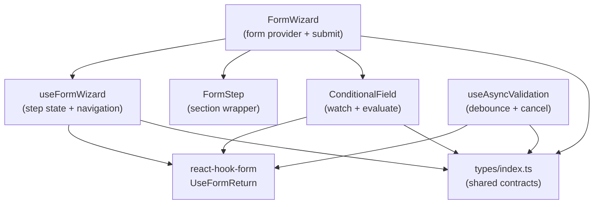

# @itiana/form-architect

Multi-step form wizard library for React. Provides a composable `FormWizard`, per-step validation with React Hook Form, conditional field rendering, and debounced async validation – all with strict TypeScript types and no runtime dependencies beyond React and react-hook-form.

## Use Cases

- **Onboarding flows** - break a long registration form into focused steps with per-step field validation
- **Checkout wizards** - shipping → payment → review, with conditional fields based on payment type
- **Dynamic surveys** - show or hide questions based on previous answers using `ConditionalField`
- **Profile editors** - async-validate unique usernames or emails before advancing to the next step
- **Configuration wizards** - multi-stage settings UIs where later steps depend on earlier choices

## Architecture



## Tech Stack

| Layer | Library |
|---|---|
| Framework | React 18 + TypeScript 5 (strict) |
| Forms | react-hook-form 7 |
| Build | Vite 5 (library mode) + vite-plugin-dts |
| Tests | Vitest 2 + React Testing Library 16 |

## Install

```bash
npm install @itiana/form-architect react-hook-form
```

Peer deps: `react ^18`, `react-dom ^18`, `react-hook-form ^7`.

## Quick Start

```tsx
import {
  FormWizard,
  FormStep,
  ConditionalField,
  useAsyncValidation,
} from '@itiana/form-architect';
import type { StepConfig } from '@itiana/form-architect';

interface RegistrationData {
  email: string;
  username: string;
  plan: 'free' | 'pro';
  teamName?: string;
}

const steps: StepConfig[] = [
  { id: 'account', title: 'Account', fields: ['email', 'username'] },
  { id: 'plan', title: 'Plan', fields: ['plan', 'teamName'] },
  { id: 'review', title: 'Review', fields: [] },
];

async function checkUsername(value: string): Promise<true | string> {
  const res = await fetch(`/api/check-username?q=${value}`);
  const { available } = await res.json() as { available: boolean };
  return available || 'Username is already taken';
}

function RegistrationWizard() {
  return (
    <FormWizard<RegistrationData>
      steps={steps}
      defaultValues={{ email: '', username: '', plan: 'free' }}
      onSubmit={(data) => console.info('Submit', data)}
    >
      {({ currentStep, wizardState, next, previous, form }) => (
        <>
          {/* Progress */}
          <p>Step {wizardState.currentStepIndex + 1} of {wizardState.totalSteps}</p>

          {currentStep.id === 'account' && (
            <FormStep title={currentStep.title} description="Enter your account details">
              <input {...form.register('email', { required: true })} placeholder="Email" />
              <input {...form.register('username', { required: true })} placeholder="Username" />
            </FormStep>
          )}

          {currentStep.id === 'plan' && (
            <FormStep title={currentStep.title}>
              <select {...form.register('plan')}>
                <option value="free">Free</option>
                <option value="pro">Pro</option>
              </select>

              <ConditionalField
                condition={{ watchField: 'plan', operator: 'eq', value: 'pro' }}
              >
                <input {...form.register('teamName')} placeholder="Team name" />
              </ConditionalField>
            </FormStep>
          )}

          {currentStep.id === 'review' && (
            <FormStep title="Review your details">
              <p>Email: {form.getValues('email')}</p>
              <p>Plan: {form.getValues('plan')}</p>
            </FormStep>
          )}

          {/* Navigation */}
          {!wizardState.isFirstStep && (
            <button type="button" onClick={previous}>Back</button>
          )}
          {!wizardState.isLastStep ? (
            <button type="button" onClick={() => next()}>Next</button>
          ) : (
            <button type="submit">Submit</button>
          )}
        </>
      )}
    </FormWizard>
  );
}
```

## Components

### `FormWizard<T>`

Root component. Wraps everything in a React Hook Form `FormProvider` and a `<form>` element. Render prop exposes the full wizard context.

| Prop | Type | Default |
|---|---|---|
| `steps` | `StepConfig[]` | required |
| `defaultValues` | `Partial<T>` | – |
| `onSubmit` | `(data: T) => void \| Promise<void>` | required |
| `children` | `(ctx: UseFormWizardReturn<T>) => ReactNode` | required |

### `FormStep`

Semantic section wrapper with an optional heading and description.

```tsx
<FormStep title="Shipping address" description="Enter where to ship your order">
  {/* form fields */}
</FormStep>
```

### `ConditionalField`

Renders children only when one or more conditions on watched fields are satisfied. Conditions evaluate without re-renders beyond those caused by the watched field changing.

```tsx
<ConditionalField
  condition={[
    { watchField: 'country', operator: 'eq', value: 'US' },
    { watchField: 'age', operator: 'gte', value: 18 },
  ]}
  allOf={true}
  fallback={<p>Not eligible</p>}
>
  <input name="ssn" />
</ConditionalField>
```

Supported operators: `eq`, `neq`, `gt`, `gte`, `lt`, `lte`, `includes`, `truthy`, `falsy`.

## Hooks

### `useFormWizard<T>(options)`

Low-level hook for building custom wizard UIs without `FormWizard`. Returns the full `UseFormWizardReturn<T>` context.

```ts
const { form, wizardState, next, previous, goTo, reset, handleSubmit } =
  useFormWizard<MyForm>({ steps, defaultValues });
```

### `useAsyncValidation<T>(validator, debounceMs?)`

Debounced async validator with in-flight cancellation. Safe to call on every keystroke.

```ts
const { validate, state } = useAsyncValidation(checkUsername, 400);

// Inside react-hook-form register:
form.register('username', {
  validate: (v) => validate(v),
});

// Render validation state:
{state.isPending && <span>Checking...</span>}
{state.error && <span style={{ color: 'red' }}>{state.error}</span>}
```

## Scripts

```bash
npm install        # install deps
npm run typecheck  # tsc --noEmit
npm test           # vitest run (all tests)
npm run build      # vite library build → dist/
```

## License

CC BY-NC 4.0 License. Copyright (c) 2026 itiana
